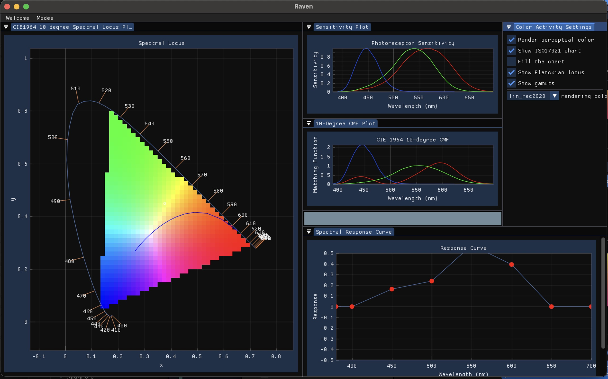

# LabRaven

This is a refactoring of OpenTimelineIO/Raven, for the purpose of exploring a modular plugin architecture. The first Activity it has is a color science exploration tool. The original raven functionality will be introduced soon as a new Activity.

